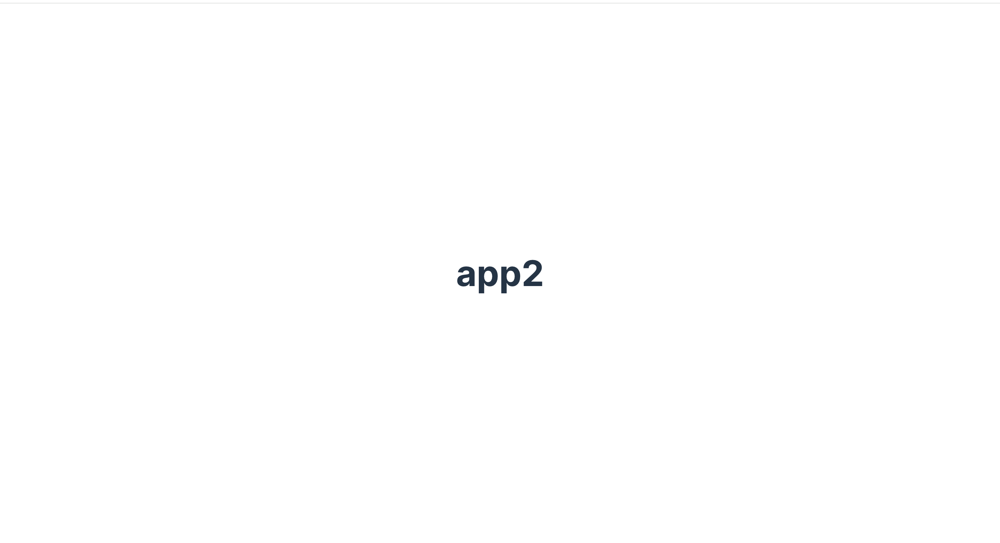
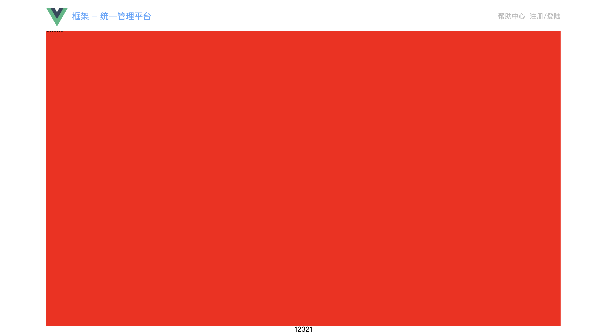

# 第一章 初始化以及框架搭建

## 1 基础介绍

### 1.1 什么是 VUE3

Vue 3 是一个用于构建用户界面的渐进式 JavaScript 框架，由尤雨溪及其团队开发。它是 Vue.js 的最新版本，于 2020 年 9 月正式发布。相比 Vue 2，Vue 3 在性能、开发体验和灵活性方面都有显著提升，以下是其主要特点和改进：

1. **性能提升**

- **更快的渲染速度**：Vue 3 使用了新的虚拟 DOM 实现，优化了 diff 算法，渲染速度比 Vue 2 快 2 倍。
- **更小的包体积**：通过 Tree-shaking 支持，Vue 3 的核心代码体积减少了 40% 以上。
- **更好的内存使用**：优化了响应式系统的内存占用。

2. **组合式 API（Composition API）**

- **更灵活的代码组织方式**：组合式 API 允许开发者将逻辑按功能组织，而不是按选项（data、methods 等）组织。
- **更好的逻辑复用**：通过自定义 Hook，可以更方便地复用逻辑。
- **更好的 TypeScript 支持**：组合式 API 对 TypeScript 的支持更加友好。

3. **响应式系统的重写**

- **基于 Proxy 的响应式系统**：Vue 3 使用 ES6 的 `Proxy` 替代了 Vue 2 的 `Object.defineProperty`，解决了 Vue 2 中无法检测数组和对象属性变化的问题。
- **更细粒度的依赖追踪**：响应式系统可以更精确地追踪依赖关系，减少不必要的更新。

4. **新的内置组件**

- **`<Teleport>`**：允许将组件渲染到 DOM 中的任意位置，常用于模态框、通知等场景。
- **`<Suspense>`**：用于处理异步组件的加载状态，提供更好的用户体验。

5. **Fragment 支持**

Vue 3 支持多根节点组件（Fragment），不再强制要求组件必须有一个根元素。

6. **更好的 TypeScript 支持**

Vue 3 完全使用 TypeScript 重写，提供了更好的类型推断和类型支持。

7. **其他改进**

- **自定义渲染器 API**：允许开发者自定义渲染逻辑，例如将 Vue 用于构建非 DOM 环境的应用（如小程序、Canvas 等）。
- **全局 API 的调整**：引入了 `createApp` 替代 Vue 2 的 `new Vue()`，使得全局 API 更加模块化。

8. **生态系统**

Vue 3 的生态系统非常丰富，包括：

- **Vite**：新一代构建工具，支持 Vue 3，提供极快的开发体验。
- **Vue Router 4**：Vue 3 的官方路由库，支持动态路由、嵌套路由等功能。
- **Pinia**：Vue 3 推荐的状态管理库，替代 Vuex，更轻量且易于使用。


### 1.2 什么是 TypeScript

TypeScript 是一种用于构建大型、复杂应用的编程语言，它通过添加类型系统和其他高级功能来扩展 JavaScript，同时保持与 JavaScript 的完全兼容。TypeScript 的目标是帮助开发者更容易地编写、维护和调试代码，尤其是在大型项目中。


### 1.3 本项目技术选型

1. VUE3 + 组合式 API
2. Vite 构建工具
3. TypeScript
4. vue-router
5. pinia 状态管理
6. element-plus
7. axios 网络交互


### 1.4 项目初始化

新建一个文件夹后进入终端： 

1. pnpm create vite -> frameworkk -> vue -> ts -> 初始化完毕

2. 安装 vue 核心依赖：cd framework -> pnpm i
3. 运行项目 : pnpm run dev
4. 项目起步完成

项目结构中：

1. Node_modules 中包含了 vue 相关的依赖

2. Package.json 中存放了 vue 的相关配置信息

3. public 文件夹下存放了相关的静态资源

4. src 是代码核心区域，删除一下的文件夹

   + 删除 components/helloworld.vue
   + 安装 vue vscode snippets 插件
   + App.vue 安装删除后输入 v3ts

   ```
   <template>
     <div>
       <h1>app2</h1>
     </div>
   </template>
   
   <script setup lang="ts">
   
   </script>
   
   <style scoped>
   
   </style>
   ```

   

------

Main.ts 中是 vue3 提供的方法 createApp 方法，可以用来创建应用实例方法

```vue
// 从 Vue 库导入 createApp 函数，用于创建 Vue 应用
import { createApp } from 'vue'  

// 导入全局 CSS 样式文件
import './style.css'  

// 导入根组件 App.vue
import App from './App.vue'  

// 创建 Vue 应用实例，并将其挂载到 HTML 页面中的 #app 元素上
createApp(App).mount('#app')  
```

上面挂在 #app 元素会在 index.html 中找到相应元素：

```vue
<!doctype html>
<html lang="en">
  <head>
    <meta charset="UTF-8" />
    <link rel="icon" type="image/svg+xml" href="/vite.svg" />
    <meta name="viewport" content="width=device-width, initial-scale=1.0" />
    <title>Vite + Vue + TS</title>
  </head>
  <body>
    <div id="app"></div>
    <script type="module" src="/src/main.ts"></script>
  </body>
</html>
```

**浏览器自动打开 package.json：**

```
"scripts": {
    "dev": "vite --open",
    "build": "vue-tsc -b && vite build",
    "preview": "vite preview"
  },
```

**Src 别名配置**

找到 vite.config.ts 配置文件，加入以下配置：

```
import { defineConfig } from 'vite'
import vue from '@vitejs/plugin-vue'

import path from 'path';

// https://vite.dev/config/
export default defineConfig({
  plugins: [vue()],

  // src 配置别名
  resolve:{
    alias:{
      "@":path.resolve(__dirname, 'src')
    }
  }
})
```

> 如果红色提示报错，安装依赖 pnpm i @types/node --save-dev


## 2 静态搭建

整体上下为：上边栏 + 下边栏 + 中间的导航窗口

### 2.1 清除默认样式

首先清除默认样式：src/style/reset.scss

```
/**
 * ENGINE
 * v0.2 | 20150615
 * License: none (public domain)
 */

*,
*:after,
*:before {
    box-sizing: border-box;

    outline: none;
}

html,
body,
div,
span,
applet,
object,
iframe,
h1,
h2,
h3,
h4,
h5,
h6,
p,
blockquote,
pre,
a,
abbr,
acronym,
address,
big,
cite,
code,
del,
dfn,
em,
img,
ins,
kbd,
q,
s,
samp,
small,
strike,
strong,
sub,
sup,
tt,
var,
b,
u,
i,
center,
dl,
dt,
dd,
ol,
ul,
li,
fieldset,
form,
label,
legend,
table,
caption,
tbody,
tfoot,
thead,
tr,
th,
td,
article,
aside,
canvas,
details,
embed,
figure,
figcaption,
footer,
header,
hgroup,
menu,
nav,
output,
ruby,
section,
summary,
time,
mark,
audio,
video {
    font: inherit;
    font-size: 100%;

    margin: 0;
    padding: 0;

    vertical-align: baseline;

    border: 0;
}

article,
aside,
details,
figcaption,
figure,
footer,
header,
hgroup,
menu,
nav,
section {
    display: block;
}

body {
    line-height: 1;
}

ol,
ul {
    list-style: none;
}

blockquote,
q {
    quotes: none;
    &:before,
    &:after {
        content: '';
        content: none;
    }
}

sub,
sup {
    font-size: 75%;
    line-height: 0;

    position: relative;

    vertical-align: baseline;
}
sup {
    top: -.5em;
}
sub {
    bottom: -.25em;
}

table {
    border-spacing: 0;
    border-collapse: collapse;
}

input,
textarea,
button {
    font-family: inhert;
    font-size: inherit;

    color: inherit;
}

select {
    text-indent: .01px;
    text-overflow: '';

    border: 0;
    border-radius: 0;

    -webkit-appearance: none;
       -moz-appearance: none;
}
select::-ms-expand {
    display: none;
}

code,
pre {
    font-family: monospace, monospace;
    font-size: 1em;
}
```

main.ts 中引入：

```
import "./style/reset.scss"
pnpm add -D sass-embedded
```


### 2.2 顶部组建

Components/framework_top/index.vue

v3ts快捷键

```
<template>
    <div>
        <h1>app</h1>
    </div>
</template>

<script setup lang="ts">

</script>

<style scoped>

</style>
```

注册成为全局组建 main.ts

```vue
import { createApp } from 'vue'
import App from './App.vue'
import "./style/reset.scss"

// 引入全局组件：顶部底部都是全局组件
import FrameworkTop from './components/framework_top/index.vue';

const app = createApp(App)
// 全局组件
app.component('FrameworkTop', FrameworkTop)
// 挂载
app.mount('#app')

```

在 App.vue 中可以直接使用：

```vue
<template>
  <div class="container">
      <!-- 顶部全局组件 -->
       <FrameworkTop/>
  </div>
</template>

<script setup lang="ts">

</script>

<style scoped>

</style>
```

**继续完善 Components/framework_top/index.vue：**

```vue
<template>
    <div class="top">
        <div class="content">
            <!-- 左侧 -->
             <div class="left">
                
                <p>框架 - 统一管理平台</p>
             </div>
             <!-- 右侧 -->
             <div class="right">
                <p class="help">帮助中心</p>
                <p class="login">注册/登陆</p>
             </div>
        </div>
    </div>
</template>

<script setup lang="ts">

</script>

<style scoped lang="scss">
.top{
    position: fixed;
    z-index: 999;
    width: 100%;
    height: 70px;
    background: #fff;
    display: flex;
    justify-content: center;
    .content{
        width: 1200px;
        height: 70px;
        background: white;
        // 元素一左一右
        display: flex;
        justify-content: space-between;
        .left{
            display: flex;
            align-items: center;
            justify-content: center;
            img{
                width: 50px;
                height: 50px;
                margin-right: 10px;
            }
            p{
                font-size: 20px;
                color: #55a6fe;
            }
        }
        .right{
            display: flex;
            align-items: center;
            justify-content: center;
            font-size: 14;
            color: #bbb;
            .help{
                margin-right: 10px;
            }
        }
    }
}
</style>
```


### 2.3 中间架构

首先修改 App.vue，给出整体框架：

```
<template>
  <div class="container">
      <!-- 顶部全局组件 -->
       <FrameworkTop/>

       <!-- 展示路由组件的区域 -->
        <div class="content">
          xxxxx
        </div>

        <!-- 底部 -->
         <div>
          12321
         </div>
  </div>
</template>

<script setup lang="ts">

</script>

<style scoped lang="scss">
  .container{
    display: flex;
    flex-direction: column;
    align-items: center;
    .content{
      margin-top: 70px;
      width: 1200px;
      min-height: 700px;
      background: red;
    }

    .bottom{
      width: 100%;
      height: 50px;
      background: cyan;
    }
  }
</style>
```




### 2.4 底部组件

类似于顶部组件，我们将底部页拆成一个全局组件，上下都是组件；中间是路由组件。

 **新建 Components/framework_bottom/index.vue：**

```vue
<template>
    <div class="bottom">
        <div class="content">
            <div class="left">
                京 IPC 备案
            </div>

            <div class="right">
                <span>联系我们</span>
                <span>合作伙伴</span>
                <span>用户协议</span>
                <span>隐私协议</span>
            </div>
        </div>
    </div>
</template>

<script setup lang="ts">

</script>

<style scoped lang="scss">
    .bottom{
        width: 100%;
        height: 50px;
        background: #f0f2f5;
        display: flex;
        justify-content: center;
        .content{
            width: 1200px;
            height: 50px;
            display: flex;
            justify-content: space-between;
            align-items: center;
            font-size: 14px;
            .right{
                span{
                    margin: 0px 5px;
                }
            }
        }
    }
</style>
```

**同时修改 main.ts 设置全局变量**

```
import { createApp } from 'vue'
import App from './App.vue'
import "./style/reset.scss"

// 引入全局组件：顶部底部都是全局组件
import FrameworkTop from './components/framework_top/index.vue';
import FrameworkBottom from './components/framework_bottom/index.vue';

const app = createApp(App)
// 全局组件
app.component('FrameworkTop', FrameworkTop)
app.component('FrameworkBottom', FrameworkBottom)
// 挂载
app.mount('#app')

```


同时修改App.vue：

```vue
<template>
  <div class="container">
      <!-- 顶部全局组件 -->
       <FrameworkTop/>

       <!-- 展示路由组件的区域 -->
        <div class="content">
          xxxxx
        </div>

        <!-- 底部 -->
         <FrameworkBottom/>
  </div>
</template>

<script setup lang="ts">

</script>

<style scoped lang="scss">
  .container{
    display: flex;
    flex-direction: column;
    align-items: center;
    .content{
      margin-top: 70px;
      width: 1200px;
      min-height: 700px;
    }

    .bottom{
      width: 100%;
      height: 50px;
      background:grey
    }
  }
</style>
```


****