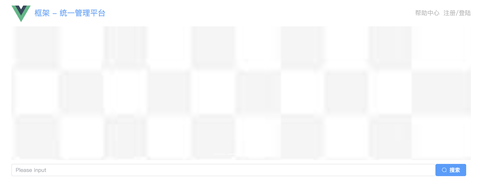
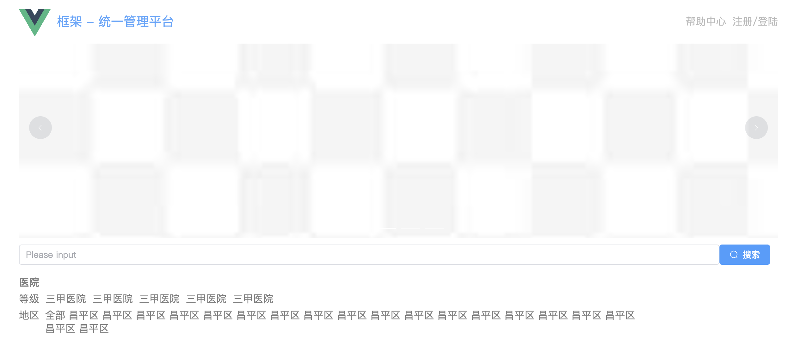
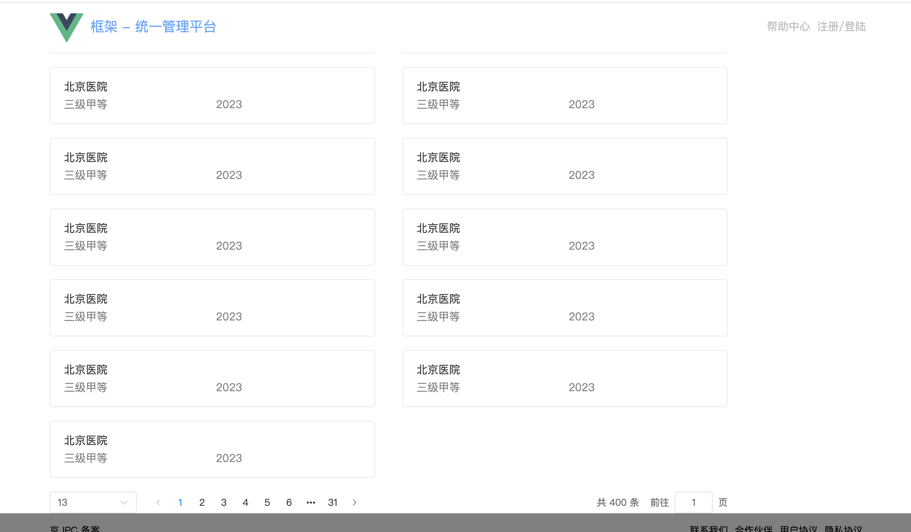

# 第二章 路由搭建以及组件拆分

## 1 项目路由的搭建与滚动

### 1.1 Vue 路由

在 Vue.js 中，路由（router）指的是管理不同视图之间导航的功能。Vue 路由是用来实现单页应用（SPA, Single Page Application）中页面之间的切换与管理的工具，它允许你在不同的 URL 路径之间导航，并渲染相应的组件。

Vue Router 是 Vue.js 的官方路由管理器。它有以下几个主要特点：

1. **声明式路由**：你可以通过配置路径和组件来定义路由关系，而不需要手动操作 DOM。
2. **嵌套路由**：支持路由的嵌套，允许更复杂的页面结构。
3. **路由守卫**：你可以在路由跳转前、跳转后或守卫路由组件的生命周期时进行一些处理。
4. **动态路由匹配**：允许在 URL 中使用动态参数，使得同一组件可以渲染不同的数据。
5. **懒加载**：支持懒加载路由，使得只有在用户访问特定路由时，相关的代码才会被加载，从而提高性能。

**基本使用**

1. **安装 Vue Router** 如果你使用 Vue CLI 创建的项目，Vue Router 会自动安装。否则，你可以通过 npm 或 yarn 安装它：

   ```
   npm install vue-router
   ```

2. **创建路由配置** 在 Vue 中，你通常会在 `router/index.js` 中定义路由。

   ```
   import Vue from 'vue';
   import Router from 'vue-router';
   import Home from '../components/Home.vue';
   import About from '../components/About.vue';
   
   Vue.use(Router);
   
   export default new Router({
     routes: [
       {
         path: '/',
         name: 'home',
         component: Home
       },
       {
         path: '/about',
         name: 'about',
         component: About
       }
     ]
   });
   ```

3. **在 Vue 实例中使用路由** 然后在你的 `main.js` 或 `app.js` 中使用这个路由：

   ```
   import Vue from 'vue';
   import App from './App.vue';
   import router from './router';
   
   new Vue({
     render: h => h(App),
     router
   }).$mount('#app');
   ```

4. **在模板中使用 `<router-link>` 和 `<router-view>`**

   - `<router-link>` 用来导航到不同的路由。
   - `<router-view>` 是路由渲染的地方，显示对应的组件。

   ```
   <template>
     <div>
       <nav>
         <router-link to="/">Home</router-link>
         <router-link to="/about">About</router-link>
       </nav>
       <router-view></router-view>
     </div>
   </template>
   ```

这样，当你点击 "Home" 或 "About" 时，Vue Router 会根据 URL 路径显示相应的组件，而无需刷新页面。


### 1.2 页面分析

项目当中至少会有两个路由：

1. 首页
2. 某个页面详情

首先创建一个 router/index.ts 文件，其次创建 pages/home.vue 以及 pages/hospital.vue 分别存放两个路由页面。

pages/home.vue: 

pages/hospital.vue:

```
<template>
    <div>
        我是首页/我是医院
    </div>
</template>

<script setup lang="ts">

</script>

<style scoped>

</style>
```

router/index.ts:

```
import {createRouter, createWebHistory} from 'vue-router'

// createRouter 方法: 用于创建路由器示例，可以管理多个路由
export default createRouter({
    // 路由模式设置
    history: createWebHistory(),
    // 管理路由
    routes:[
        // 至少有两个路由
        {
            path: '/home',
            component: () => import('../pages/home/index.vue')
        },
        {
            path: '/hospital',
            component: () => import('../pages/hospital/index.vue')
        },
        {
            path: '/',
            redirect: '/home'
        }
    ],
    // 滚动行为，控制滚动条的位置
    scrollBehavior(){
        return{
            left:0,
            top:0
        }
    }
})
```

之后，我们需要回到 main.js 安装对应的路由如下：

```
// 引入路由
import router from './router'

const app = createApp(App)
// 全局组件
app.component('FrameworkTop', FrameworkTop)
app.component('FrameworkBottom', FrameworkBottom)
// 安装 router
app.use(router);
// 挂载
app.mount('#app')
```

再后，我们需要告诉路由组件在哪里进行展示，即修改 App.vue:

```
<template>
  <div class="container">
      <!-- 顶部全局组件 -->
       <FrameworkTop/>

       <!-- 展示路由组件的区域 -->
        <div class="content">
          <!-- 展示路由组件 -->
           <router-view></router-view>
        </div>

        <!-- 底部 -->
         <FrameworkBottom/>
  </div>
</template>
```

现在就可以根据路由及时切换内容：


## 2 首页静态搭建 banner

现在要完成项目中首页的业务：

1. 首页上面有一个轮播图
2. 首页上面有个搜索框，用于搜索对应的业务
3. 其次还有列举的医院类型

所以，我们需要对首页相关组件进行拆分，这里我们使用 UI组件库 Element-Plus

```
pnpm i element-plus
```

main.ts 中引入：

```
// main.ts
import { createApp } from 'vue'
import ElementPlus from 'element-plus'
import 'element-plus/dist/index.css'
import App from './App.vue'

const app = createApp(App)

app.use(ElementPlus)
app.mount('#app')
```

### 2.1 轮播图

找到首页路由组件 pages/home.vue

首页最上方想放置一个轮播图，找到element 中的走马灯：

https://element-plus.org/zh-CN/component/carousel.html

将轮播图抽取成为一个组件，放在  pages/home/carousel/index.vue 中：

```
<template>
    <el-carousel height="350px">
            <el-carousel-item v-for="item in 4" :key="item">
                
            </el-carousel-item>
        </el-carousel>
</template>

<script setup lang="ts">

</script>

<style scoped lang="scss">
    img{
        width: 100%;
        height: 35;
    }
</style>
```

 pages/home/index.vue中：

引入轮播图组件

```
<template>
    <div>
        <!-- 首页轮播特结构 -->
        <Carousel></Carousel>
    </div>
</template>

<script setup lang="ts">
    // 引入轮播图组件
    import Carousel from './carousel/index.vue'
</script>

<style scoped></style>
```


### 2.2 搜索框

搜索框组件为 form - Autocomplete

https://element-plus.org/zh-CN/component/autocomplete.html

将搜索框抽取成为一个组件，放在  pages/home/search/index.vue 中：

```
<template>
    <div class="search">
        <el-autocomplete v-model="state" :fetch-suggestions="querySearch" popper-class="my-autocomplete"
            placeholder="Please input" @select="handleSelect"></el-autocomplete>

        <div class="button">
            <el-button type="primary" size="default" :icon="Search">搜索</el-button>
        </div>
    </div>
</template>

<script setup lang="ts">
// 引入 ep 提供的图标
import { Search } from "@element-plus/icons-vue"
</script>

<style scoped lang="scss">
.search {
    display: flex;
    justify-content: space-between;
    align-items: center;
    margin: 10px 0px;

    .button {
        width: 100px;
    }
}
</style>
```

 pages/home/index.vue中：

引入搜索框组件

```
<template>
    <div>
        <!-- 首页轮播特结构 -->
        <Carousel></Carousel>
        <!-- 搜索框 -->
        <Search></Search>
    </div>
</template>

<script setup lang="ts">
// 引入轮播图组件
import Carousel from './carousel/index.vue'
import Search from './search/index.vue'
</script>

<style scoped></style>
```

图表组件：

```
pnpm install @element-plus/icons-vue
```

效果图



如果想要修改组件内部的样式：深度选择器

```
::v-deep
.el-input__wrapper{
	width: 300px
}

:deep(.el-input__wrapper){
	width: 300px
}
```


### 2.3 医院和地区组件

左右布局：

+ 左边展示医院信息等等
+ 右边展示平台广告

可以使用 layout 布局

https://element-plus.org/zh-CN/component/layout.html#layout-%E5%B8%83%E5%B1%80

首先新建两个组件：封装为等级组件和地区组件

pages/home/level/index.vue

```vue
<template>
    <div class="level">
        <h1>医院</h1>
        <div class="content">
            <div class="left">等级</div>
            <ui class="hospital">
                <li>三甲医院</li>
                <li>三甲医院</li>
                <li>三甲医院</li>
                <li>三甲医院</li>
                <li>三甲医院</li>
            </ui>
        </div>
    </div>
</template>

<script setup lang="ts">

</script>

<style scoped lang="scss">
.level {
    color: #7f7f7f; 
    h1 {
        font-weight: 900;
        margin: 10px 0px;
    }

    .content {
        display: flex;

        .left {
            margin-right: 10px;
        }

        .hospital {
            list-style-type: none;
            display: flex;

            li {
                margin-right: 10px;

                &.active {
                    color: #55a6fe;
                }
            }

            li:hover {
                color: #55a6fe;
            }
        }
    }
}
</style>
```

pages/home/region/index.vue

```vue
<template>
    <div class="region">
        <div class="content">
            <div class="left">地区</div>
            <ui>
                <li>全部</li>
                <li>昌平区</li>
                <li>昌平区</li>
                <li>昌平区</li>
                <li>昌平区</li>
                <li>昌平区</li>
                <li>昌平区</li>
                <li>昌平区</li>
                <li>昌平区</li>
                <li>昌平区</li>
                <li v-for="item in 10" :key="item">昌平区</li>
            </ui>
        </div>
    </div>
</template>

<script setup lang="ts">

</script>

<style scoped lang="scss">
.region{
    color: #7f7f7f;
    margin-top: 10px;
    .content{
        display: flex;
        .left{
            margin-right: 0px;
            width: 45px;
        }
        ui{
            list-style-type: none;
            display: flex;
            flex-wrap: wrap;
            li{
                margin-right: 5px;
                margin-bottom: 5px;
                &.active{
                    color: #55a6fe;
                }
            }
            li:hover{
                color: #55a6fe;
            }
        }
    }
}
</style>
```

之后继续修改 pages/home/index.vue

```vue
<template>
    <div>
        <!-- 首页轮播特结构 -->
        <Carousel></Carousel>
        <!-- 搜索框 -->
        <HomeSearch></HomeSearch>

        <!--  底部布局结构-->
        <el-row gutter="20">
            <el-col :span="20">
                <Level/>
                <Region/>
            </el-col>
            <el-col :span="4">
                
            </el-col>
        </el-row>
    </div>
</template>

<script setup lang="ts">
// 引入轮播图组件
import Carousel from './carousel/index.vue'
import HomeSearch from './search/index.vue'
import Level from './level/index.vue'
import Region from './region/index.vue'
</script>

<style scoped></style>
```

至此，医院和地区组件完成，效果如下：




### 2.4 展示 - 医院卡片组件

可以将一个卡片封装成为一个组件，用来复用：

pages/home/card/index.vue

```vue
<template>
    <el-card class="box-card" shadow="hover">
        <div class="content">
            <div class="left">
                <div class="hospital_name">
                    北京医院
                </div>
                <div class="tip">
                    <div class="level">三级甲等</div>
                    <div class="time">2023</div>
                </div>
            </div>
            <div class="right">

            </div>
        </div>
    </el-card>
</template>

<script setup lang="ts">

</script>

<style scoped lang="scss">
.content{
    display: flex;
    justify-content: space-between;
    .right{
        img{
            width: 50px;
            height: 50px;
        }
    }
    .left{
        width: 60%;
        .tip{
            color: #7f7f7f;
            margin-top: 10px;
            display: flex;
            justify-content: space-between;
            .level{
                display: flex;
                align-items: center;
            }
        }
    }
}
</style>
```

之后继续修改 pages/home/index.vue

```vue
<template>
    <div>
        <!-- 首页轮播特结构 -->
        <Carousel></Carousel>
        <!-- 搜索框 -->
        <HomeSearch></HomeSearch>

        <!--  底部布局结构-->
        <el-row gutter="20">
            <el-col :span="20">
                <Level />
                <Region />
                <!-- 展示医院的结构 -->
                <div class="hospital">
                    <Card v-for="item in 13" :key="item"></Card>
                </div>
                <!-- 分页器容器 -->
                <div class="pagination-container">
                    <el-pagination v-model:current-page="pageNo" v-model:page-size="pageSize"
                        :page-sizes="[10, 20, 30, 40]" 
                        :size="size"
                        layout="sizes,prev,pager,next,->,total, jumper" 
                        :total="400" />
                </div>
            </el-col>
            <el-col :span="4">

            </el-col>
        </el-row>
    </div>
</template>

<script setup lang="ts">
// 引入轮播图组件
import Carousel from './carousel/index.vue'
import HomeSearch from './search/index.vue'
import Level from './level/index.vue'
import Region from './region/index.vue'
import Card from './card/index.vue'

// 分页需要的数据
import { ref } from 'vue'
let pageNo = ref<number>(1)
let pageSize = ref<number>(13)
</script>

<style scoped lang="scss">
.hospital {
    display: flex;
    flex-wrap: wrap;
    /* 使卡片能够自动换行 */
    justify-content: space-between;
    /* 使每行的卡片平均分配 */
}

.hospital .el-card {
    width: 48%;
    /* 每行两个卡片，宽度设为 48% */
    margin-bottom: 20px;
    /* 卡片之间的间距 */
}

</style>

```

效果图如下：



