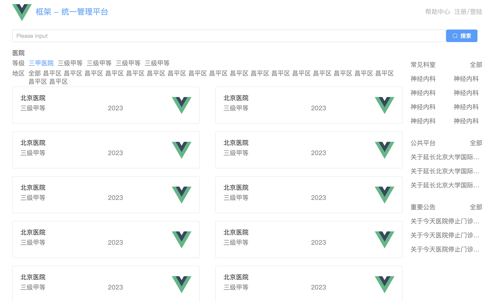

# 第四章 首页右侧搭建、菜单与子路由、Pania 应用

## 4.1 右侧静态搭建

搭建组件

framework/src/pages/home/tip/index.vue：

```vue
<template>
    <div class="tip">
        <!-- 常见科室模块 -->
        <div class="department">
            <div class="header">
                <!-- 左侧显示 '常见科室' 文本 -->
                <div class="left">
                    常见科室
                </div>
                <!-- 右侧显示 '全部' 文本，可能是点击展开更多科室的按钮 -->
                <div class="right">
                    全部
                </div>
            </div>
            <div class="content">
                <ul>
                    <!-- 列表项显示常见科室 -->
                    <li>神经内科</li>
                    <li>神经内科</li>
                    <li>神经内科</li>
                    <li>神经内科</li>
                    <li>神经内科</li>
                    <li>神经内科</li>
                    <li>神经内科</li>
                    <li>神经内科</li>
                </ul>
            </div>
        </div>

        <!-- 公共平台模块 -->
        <div class="notice">
            <div class="header">
                <!-- 左侧显示 '公共平台' 文本 -->
                <div class="left">
                    <span>公共平台</span>
                </div>
                <!-- 右侧显示 '全部' 文本，可能是点击查看所有通知的按钮 -->
                <div class="right">
                    <span>全部</span>
                </div>
            </div>
            <div class="content">
                <ul>
                    <!-- 列表项显示公共平台的通知 -->
                    <li>关于延长北京大学国际医科学院放假的通知</li>
                    <li>关于延长北京大学国际医科学院放假的通知</li>
                    <li>关于延长北京大学国际医科学院放假的通知</li> 
                </ul>
            </div>
         </div>

         <!-- 重要公告模块 -->
         <div class="notice">
            <div class="header">
                <!-- 左侧显示 '重要公告' 文本 -->
                <div class="left">
                    <span>重要公告</span>
                </div>
                <!-- 右侧显示 '全部' 文本，可能是点击查看所有公告的按钮 -->
                <div class="right">
                    <span>全部</span>
                </div>
            </div>
            <div class="content">
                <ul>
                    <!-- 列表项显示重要公告 -->
                    <li>关于今天医院停止门诊的公告</li>
                    <li>关于今天医院停止门诊的公告</li>
                    <li>关于今天医院停止门诊的公告</li>
                </ul>
            </div>
         </div>
    </div>
</template>

<script setup lang="ts">
// 目前没有额外的脚本逻辑，可以根据需要在这里添加
</script>

<style scoped lang="scss">
.tip{
    /* 外层容器的上边距和文字颜色 */
    margin-top: 40px;
    color: #7f7f7f;

    /* 常见科室模块样式 */
    .department{
        .header{
            /* 使用 Flexbox 实现左右布局 */
            display: flex;
            justify-content: space-between;
            .left{
                /* 左侧区域的样式 */
                display: flex;
                span{
                    /* 在左侧的 span 之间加入 5px 的左边距 */
                    margin-left: 5px;
                }
            }
        }
        .content{
            ul{
                /* 使用 Flexbox 使列表项水平排列，并允许换行 */
                display: flex;
                flex-wrap: wrap;
                justify-content: space-between;
                li{
                    /* 每个列表项占据 40% 宽度，且之间有 20px 的垂直间距 */
                    width: 40%;
                    margin-top: 20px;
                }
            }
        }
    }

    /* 公共平台和重要公告模块的样式 */
    .notice{
        margin-top: 40px;
        .header{
            /* 使用 Flexbox 实现左右布局 */
            display: flex;
            justify-content: space-between;
        }
        .content{
            ul{
                li{
                    /* 单行文本溢出时显示省略号 */
                    overflow: hidden;
                    text-overflow: ellipsis;
                    white-space: nowrap;
                    /* 每个列表项的垂直间距 */
                    margin-top: 20px;
                }
            }
        }
    }
}
</style>

```

在 framework/src/pages/home/index.vue 中使用上面的组件：

```vue
<el-col :span="4">
	<Tip></Tip>
</el-col>
```

展示效果，注意观察右侧：




## 4.2 医院详情以及子路由

首先去 ep 里面找到 menu 组件代码如下，方便后续构建menu：

```vue
<template>
  <el-row class="tac">
    <el-col :span="12">
      <h5 class="mb-2">Default colors</h5>
      <el-menu
        default-active="2"
        class="el-menu-vertical-demo"
        @open="handleOpen"
        @close="handleClose"
      >
        <el-sub-menu index="1">
          <template #title>
            <el-icon><location /></el-icon>
            <span>Navigator One</span>
          </template>
          <el-menu-item-group title="Group One">
            <el-menu-item index="1-1">item one</el-menu-item>
            <el-menu-item index="1-2">item two</el-menu-item>
          </el-menu-item-group>
          <el-menu-item-group title="Group Two">
            <el-menu-item index="1-3">item three</el-menu-item>
          </el-menu-item-group>
          <el-sub-menu index="1-4">
            <template #title>item four</template>
            <el-menu-item index="1-4-1">item one</el-menu-item>
          </el-sub-menu>
        </el-sub-menu>
        <el-menu-item index="2">
          <el-icon><icon-menu /></el-icon>
          <span>Navigator Two</span>
        </el-menu-item>
        <el-menu-item index="3" disabled>
          <el-icon><document /></el-icon>
          <span>Navigator Three</span>
        </el-menu-item>
        <el-menu-item index="4">
          <el-icon><setting /></el-icon>
          <span>Navigator Four</span>
        </el-menu-item>
      </el-menu>
    </el-col>
    <el-col :span="12">
      <h5 class="mb-2">Custom colors</h5>
      <el-menu
        active-text-color="#ffd04b"
        background-color="#545c64"
        class="el-menu-vertical-demo"
        default-active="2"
        text-color="#fff"
        @open="handleOpen"
        @close="handleClose"
      >
        <el-sub-menu index="1">
          <template #title>
            <el-icon><location /></el-icon>
            <span>Navigator One</span>
          </template>
          <el-menu-item-group title="Group One">
            <el-menu-item index="1-1">item one</el-menu-item>
            <el-menu-item index="1-2">item two</el-menu-item>
          </el-menu-item-group>
          <el-menu-item-group title="Group Two">
            <el-menu-item index="1-3">item three</el-menu-item>
          </el-menu-item-group>
          <el-sub-menu index="1-4">
            <template #title>item four</template>
            <el-menu-item index="1-4-1">item one</el-menu-item>
          </el-sub-menu>
        </el-sub-menu>
        <el-menu-item index="2">
          <el-icon><icon-menu /></el-icon>
          <span>Navigator Two</span>
        </el-menu-item>
        <el-menu-item index="3" disabled>
          <el-icon><document /></el-icon>
          <span>Navigator Three</span>
        </el-menu-item>
        <el-menu-item index="4">
          <el-icon><setting /></el-icon>
          <span>Navigator Four</span>
        </el-menu-item>
      </el-menu>
    </el-col>
  </el-row>
</template>

<script lang="ts" setup>
import {
  Document,
  Menu as IconMenu,
  Location,
  Setting,
} from '@element-plus/icons-vue'
const handleOpen = (key: string, keyPath: string[]) => {
  console.log(key, keyPath)
}
const handleClose = (key: string, keyPath: string[]) => {
  console.log(key, keyPath)
}
</script>
```


### 4.2.1 医院详情页框架搭建

```vue
<template>
    <!-- 整体医院页面容器 -->
    <div class="hospital">
        
        <!-- 左侧菜单区域 -->
        <div class="menu">
            <!-- 顶部的路径导航，显示当前所在的页面路径 -->
            <div class="top">
                <!-- 使用 Element Plus 提供的 HomeFilled 图标 -->
                <el-icon><HomeFilled/></el-icon>
                <!-- 显示当前页面路径，路径是“/ 医院详情信息” -->
                <p>/ 医院详情信息</p>
            </div>

            <!-- Element Plus 的菜单组件 -->
            <!-- :default-active="..." 表示根据当前路径自动选中对应的菜单项 -->
            <el-menu :default-active="$route.path" class="el-menu-vertical-demo">
                
                <!-- 预约挂号菜单项 -->
                <el-menu-item index="hospital/register" @click="changeActive('/hospital/register')">
                    <!-- 使用 Element Plus 提供的图标 -->
                    <el-icon><icon-menu /></el-icon>
                    <span>预约挂号</span>
                </el-menu-item>

                <!-- 医院详情菜单项 -->
                <el-menu-item index="hospital/detail" @click="changeActive('/hospital/detail')">
                    <el-icon><document /></el-icon>
                    <span>医院详情</span>
                </el-menu-item>

                <!-- 预约通知菜单项 -->
                <el-menu-item index="hospital/notice" @click="changeActive('/hospital/notice')">
                    <el-icon><setting /></el-icon>
                    <span>预约通知</span>
                </el-menu-item>

                <!-- 停诊信息菜单项 -->
                <el-menu-item index="hospital/close" @click="changeActive('/hospital/close')">
                    <el-icon><InfoFilled /></el-icon>
                    <span>停诊信息</span>
                </el-menu-item>

                <!-- 查询取消菜单项 -->
                <el-menu-item index="hospital/search" @click="changeActive('/hospital/search')">
                    <el-icon><Search /></el-icon>
                    <span>查询取消</span>
                </el-menu-item>

            </el-menu>
        </div>

        <!-- 右侧内容区域，路由视图 -->
        <div class="content">
            <!-- 这里用 <router-view> 显示对应的路由内容 -->
            <router-view></router-view>
        </div>
    </div>
</template>

<script setup lang="ts">
// 导入 Element Plus 图标
import {
    Document,
    HomeFilled,
    Menu as IconMenu,
    InfoFilled,
    Location,
    Search,
    Setting,
} from '@element-plus/icons-vue'

// 引入 Vue Router 的路由相关函数
import { useRoute, useRouter } from 'vue-router';

// 获取当前的路由信息和路由对象
let $route = useRoute(); // 获取当前路由信息
let $router = useRouter(); // 获取路由对象，用来进行路由跳转

// 菜单项点击事件
const changeActive = (path: string) => {
    // 使用 $router.push() 方法实现路由跳转
    $router.push({ path });
}
</script>

<style scoped lang="scss">
/* 样式部分，使用了 flexbox 布局 */

.hospital {
    display: flex; /* 使用 flexbox 布局 */

    /* 左侧菜单区域的样式 */
    .menu {
        .top{
            display: flex; /* 让路径导航部分横向排列 */
            margin-bottom: 20px; /* 底部间距 */
        }
        flex: 2; /* 左侧菜单占总宽度的 2/10 */
        display: flex;
        flex-direction: column; /* 垂直排列菜单项 */
        align-items: center; /* 让菜单项水平居中 */
    }

    /* 右侧内容区域的样式 */
    .content {
        flex: 8; /* 右侧内容区域占总宽度的 8/10 */
    }
}
</style>

```

**`<template>` 部分**：

- **`<div class="hospital">`**：是整个页面的容器，包含了左侧菜单和右侧内容区域。
- 左侧菜单 (`menu`)：
  - **路径导航 (`top`)**：显示当前页面路径。使用了 `HomeFilled` 图标，并且显示了路径 `/ 医院详情信息`。
  - **菜单项 (`el-menu-item`)**：使用 `el-menu` 组件来创建一个垂直的菜单。每个菜单项 (`el-menu-item`) 使用 `index` 属性来设置菜单项的索引，并绑定 `@click` 事件来触发 `changeActive` 方法。
  - **每个菜单项中的图标**：使用了不同的 `el-icon`，这些图标来自 `@element-plus/icons-vue` 包。
- 右侧内容区域 (`content`)：
  - 使用 `<router-view>` 组件来显示路由的内容，`<router-view>` 会根据当前路由动态加载对应的页面组件。

<script setup> 部分：

- **图标导入**：从 `@element-plus/icons-vue` 中导入了多个图标组件，例如 `HomeFilled`、`Document`、`Search` 等。
- 路由相关函数：
  - `useRoute()`：获取当前路由的相关信息，比如路径、参数等。
  - `useRouter()`：获取路由对象，允许程序控制路由跳转。
- **`changeActive` 方法**：当点击菜单项时，通过调用 `$router.push()` 实现页面跳转，传入新的路径 `path`。

<style scoped> 部分：

- 使用 

  `flexbox`

   布局来控制左右两部分的宽度和排列方式：

  - `.menu` 类设置了左侧菜单区域，宽度占总宽度的 2/10，垂直排列菜单项并让其水平居中。
  - `.content` 类设置了右侧内容区域，宽度占总宽度的 8/10。

- **`top` 类**：用于设置路径导航的样式，使用 `flex` 布局让图标和文字横向排列，且通过 `margin-bottom: 20px` 增加底部间距。


### 4.2.2 子路由设置

```typescript
{
    path: '/hospital',  // 设置父路由的路径为 '/hospital'
    component: () => import('../pages/hospital/index.vue'),  // 当访问 '/hospital' 路径时，加载该组件
    children: [  // 子路由配置，表示该路由下有多个子路由
        {
            path: 'register',  // 子路由的路径，相对于父路由，实际路径为 '/hospital/register'
            component: () => import('../pages/hospital/register/index.vue')  // 访问 '/hospital/register' 时，加载该组件
        },
        {
            path: 'detail',  // 子路由的路径，相对于父路由，实际路径为 '/hospital/detail'
            component: () => import('../pages/hospital/detail/index.vue')  // 访问 '/hospital/detail' 时，加载该组件
        },
        {
            path: 'notice',  // 子路由的路径，相对于父路由，实际路径为 '/hospital/notice'
            component: () => import('../pages/hospital/notice/index.vue')  // 访问 '/hospital/notice' 时，加载该组件
        },
        {
            path: 'close',  // 子路由的路径，相对于父路由，实际路径为 '/hospital/close'
            component: () => import('../pages/hospital/close/index.vue')  // 访问 '/hospital/close' 时，加载该组件
        },
        {
            path: 'search',  // 子路由的路径，相对于父路由，实际路径为 '/hospital/search'
            component: () => import('../pages/hospital/search/index.vue')  // 访问 '/hospital/search' 时，加载该组件
        },
    ]
}

```

**`path: '/hospital'`**：父路由路径为 `/hospital`，当访问该路径时，加载 `../pages/hospital/index.vue` 组件，作为父级页面的入口。

**`children`**：在父路由下有多个子路由，它们的路径是相对于父路由的：

- 例如，`path: 'register'` 实际上是 `/hospital/register`，访问该路径时会加载 `../pages/hospital/register/index.vue` 组件。
- 同理，`path: 'detail'` 实际路径为 `/hospital/detail`，`path: 'notice'` 实际路径为 `/hospital/notice`，等等。

**`component: () => import('...')`**：懒加载组件，只有当访问对应的路由时才会加载该组件，优化了应用的性能。

**子路由的作用：**

- **嵌套路由**：`/hospital` 是一个父路由，`children` 中定义的路由是它的子路由。当用户访问 `/hospital` 时，可以在该页面内部根据不同的子路由展示不同的内容。
- **动态加载**：每个子路由的组件都通过 `import()` 动态加载，避免了一开始就加载所有页面，提高了页面加载效率。

这些子路由的设计可以让你在 `/hospital` 页面中嵌套不同的页面内容，例如预约挂号、医院详情、预约通知等，而不需要刷新页面或跳转到新的 URL。


## 4.3 pania 存储医院详情

### 4.3.1 pania 介绍

**Pinia** 是 Vue 生态系统中官方推荐的 **状态管理库**，它被设计为 Vue 3 的替代 Vuex 的状态管理方案。Pinia 提供了更简单、更现代的 API 和更高效的性能，特别是与 Vue 3 的 Composition API 紧密集成。Pinia 的设计灵感来自于 Vuex，但它的 API 更加简洁，适合 Vue 3 的特性，尤其是 **响应式** 和 **类型推导**。

主要特点：

1. **简洁和直观的 API**：
   - Pinia 的 API 比 Vuex 更加简洁、直观，尤其是在 Vue 3 中，它与 Composition API 紧密集成，使用起来非常自然。
2. **与 Composition API 完美配合**：
   - Pinia 充分利用了 Vue 3 的 Composition API，它是专门为 Composition API 设计的，能够更好地支持响应式和类型推导。
3. **响应式和持久化**：
   - Pinia 内部使用 Vue 的响应式系统来管理状态，确保状态的变化会自动反映到组件中。
   - 你可以方便地使用 Pinia 来持久化存储，例如通过插件或其他方法实现状态持久化。
4. **支持开发者工具**：
   - Pinia 可以与 Vue DevTools 集成，提供强大的调试功能，比如查看状态、变更记录等。
5. **支持模块化**：
   - Pinia 的状态是模块化的，可以轻松地将状态拆分为多个 store，实现更好的代码分离和管理。
6. **类型推导**：
   - Pinia 完全支持 TypeScript，能够提供非常强的类型推导，减少运行时错误并提高开发效率。

安装：

要使用 Pinia，首先需要安装它：

```
pnpm i pinia
```

然后，你需要在 Vue 应用中引入并注册 Pinia：

```
import { createPinia } from 'pinia'
import { createApp } from 'vue'
import App from './App.vue'

const app = createApp(App)
app.use(createPinia())  // 在 Vue 应用中使用 Pinia
app.mount('#app')
```

### 4.3.2 使用 Pinia 创建 Store：

在 Pinia 中，`store` 是管理应用状态的地方。你可以创建一个 store 来保存状态，并提供 getter 和 action 来管理数据。

```
// stores/counter.ts
import { defineStore } from 'pinia'

export const useCounterStore = defineStore('counter', {
  state: () => ({
    count: 0
  }),
  actions: {
    increment() {
      this.count++
    },
    decrement() {
      this.count--
    }
  },
  getters: {
    doubleCount: (state) => state.count * 2
  }
})
```

在这个例子中，我们创建了一个 `counter` store，其中包含了：

- **state**：用于存储状态，在这里是 `count`。
- **actions**：用于更新状态的方法，例如 `increment` 和 `decrement`。
- **getters**：用于获取派生状态的计算属性，例如 `doubleCount`。

### 4.3.3 在组件中使用 Pinia Store：

```
<template>
  <div>
    <p>Count: {{ counter.count }}</p>
    <p>Double Count: {{ counter.doubleCount }}</p>
    <button @click="counter.increment">Increment</button>
    <button @click="counter.decrement">Decrement</button>
  </div>
</template>

<script setup lang="ts">
import { useCounterStore } from '../stores/counter'

// 获取 store 实例
const counter = useCounterStore()
</script>
```

在组件中使用时，只需通过 `useCounterStore()` 获取 store 实例，并直接访问或操作其中的状态、getters 和 actions。

特性和常见用法：

1. **响应式状态**：
   - Pinia 中的 `state` 是响应式的，当你修改它时，Vue 会自动更新 UI。
2. **Getters**：
   - `getters` 是从 `state` 派生出的计算属性，可以在组件中像普通属性一样访问。
3. **Actions**：
   - `actions` 是用于修改 `state` 或执行异步操作的方法。你可以在 `actions` 中修改 `state`，并在组件中调用这些方法。
4. **模块化 Store**：
   - 可以在多个文件中创建多个 store，Pinia 支持按模块拆分和组合 store，帮助管理大型应用的状态。

### 4.3.4 示例：创建一个 Todo List Store

```
// stores/todo.ts
import { defineStore } from 'pinia'

export const useTodoStore = defineStore('todo', {
  state: () => ({
    todos: [] as string[]
  }),
  actions: {
    addTodo(todo: string) {
      this.todos.push(todo)
    },
    removeTodo(index: number) {
      this.todos.splice(index, 1)
    }
  }
})
```

在组件中使用：

```
<template>
  <div>
    <input v-model="newTodo" />
    <button @click="addTodo">Add Todo</button>
    <ul>
      <li v-for="(todo, index) in todoStore.todos" :key="index">
        {{ todo }} 
        <button @click="removeTodo(index)">Delete</button>
      </li>
    </ul>
  </div>
</template>

<script setup lang="ts">
import { ref } from 'vue'
import { useTodoStore } from '../stores/todo'

const todoStore = useTodoStore()
const newTodo = ref('')

const addTodo = () => {
  todoStore.addTodo(newTodo.value)
  newTodo.value = ''
}

const removeTodo = (index: number) => {
  todoStore.removeTodo(index)
}
</script>
```


### 4.3.5 本项目实践

首先在 framework/src/pages/home/card/index.vue 进行路由跳转时需要将 code 属性带着跳转传递

```
$router.push({path: '/hospital/register', query:{hoscode:props.hospitalInfo.hoscode}})
```

详情页拿到医院编码：

1. **获取 code**
2. 进行请求（不做展示）

这里就涉及一个问题，在 hospital 路由下获取一次请求，想给五哥子路由使用该请求。

一个比较好的方法是在hospital下请求一次，然后使用 pinia 将状态存储起来，之后如果有想要的数据则直接向 pinia 获取。

**首先补充一个请求：framework/src/api/hospital/index.ts**

```typescript
// 统一管理首页模块接口
import request from "../../utils/request";  // 引入封装好的 request 工具，用于发起 HTTP 请求

// 通过枚举管理首页模块的接口地址
enum API {
    // 获取已有医院的 URL
    HOSPITAL_URL = '/hosp/hospital/'  // 定义一个枚举，包含获取医院信息的接口地址
}

// 定义一个请求函数 reqHospitalDetail 用于获取医院数据
// 该函数接受两个参数：page（页码）和 limit（每页显示的数据条数）
export const reqHospitalDetail = (hoscode:string) => 
    request.get<any>(API.HOSPITAL_URL + `${hoscode}`);  // 使用封装好的 request 工具发起 GET 请求，并传递页码和每页限制，返回一个泛型为 `any` 的结果
```

开始定义一个 pinia 存储仓库：framework/src/store/modules/hospitalDetail.ts

```typescript
// 导入 Pinia 中的 `defineStore` 函数
import { defineStore } from "pinia"

// Pinia 仓库的定义，`defineStore` 用于定义一个新的 store（仓库）
const useDetailStore = defineStore('Detail', {
    
     // `state` 用于定义 store 中的状态，这里的 `state` 返回一个空对象
    state: () => {
        return {
            hospitalInfo: {}
        }  // 目前状态为空对象，通常在此处会定义需要管理的状态
    },
    
    // `actions` 用于定义修改状态的方法，可以在这里添加各种方法来操作 store 中的状态
    actions: {
        // actions 内可以添加方法，例如：
        // async fetchData() { /* 异步操作 */ }
        async getHospital(hoscode: any){
            ...
        }
    },
    
    
    // `getters` 用于定义基于 state 派生出来的计算属性，类似 Vue 组件中的计算属性
    getters: {
        // getters 示例：
        // fullName: (state) => state.firstName + ' ' + state.lastName
    }
})

// 将该 store 对外暴露，外部可以通过 `useDetailStore()` 来使用该仓库
export default useDetailStore

```

**framework/src/pages/hospital/index.vue 中准备使用数据：**

```typescript
// 准备加载 pinia 数据
import { onMounted } from 'vue';
import useDetailStore from '../../store/modules/hospitalDetail';
let detailStore = useDetailStore();
onMounted(()=>{
    detailStore.getHospital($route.query.hoscode)
})
```


## 4.4 医院详情页 静态搭建

即对下面五个静态页面进行搭建：

1. framework/src/pages/hospital/close/index.vue
2. framework/src/pages/hospital/detail/index.vue
3. framework/src/pages/hospital/notice/index.vue
4. framework/src/pages/hospital/register/index.vue
5. framework/src/pages/hospital/search/index.vue

搭建过程与前面大同小异，省略

**需要注意的是，使用 pinia 的代码如下：**

```vue
<template>
  <div>
   	{{hospitalStore.hospitalInfo.hoapital?.hosname}}
    ... 类似调用
  </div>
</template>

<script setup lang="ts">
import { useDetailStore } from '../../store/modules/hospitalDetail'
let hospitalStore = useDetailStore()
</script>
```

