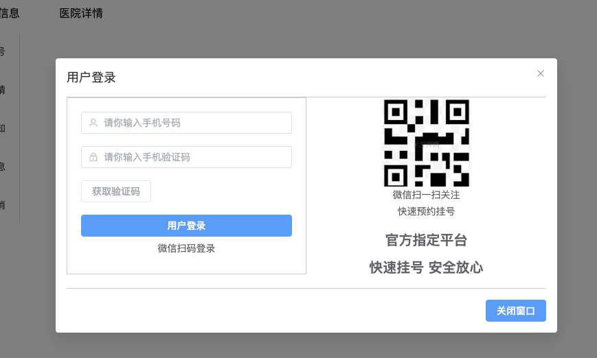
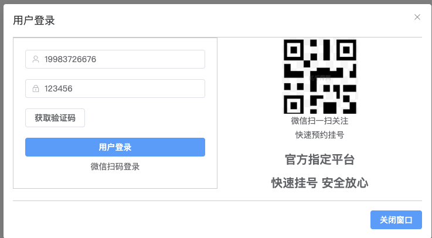
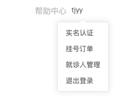
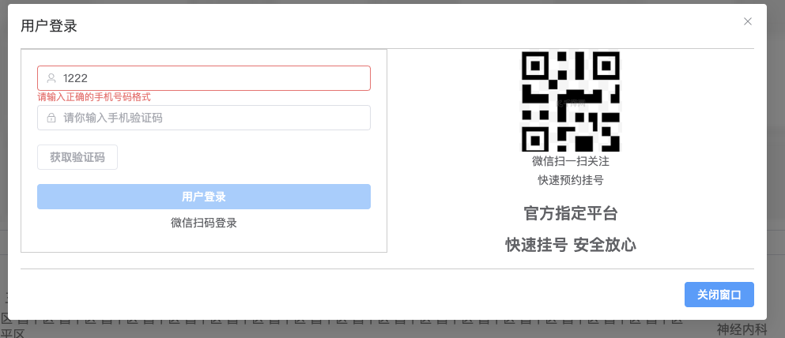

# 第五章 登陆模块、退出登录以及微信登录

## 1 login 组件的显示与隐藏

将 Login 作为全局组件进行编写，并在 App.vue 中注册：

framework/src/components/login/index.vue

```vue
<template>
    <!-- 登录容器 -->
    <div class="login_container">
        <!-- Element Plus 弹窗，v-model 双向绑定控制显示/隐藏 -->
        <el-dialog v-model="useStore.visiable" title="用户登录">
            <div class="content">
                <!-- 两列布局，左侧表单，右侧内容 -->
                <el-row>
                    <!-- 左侧：登录表单 -->
                    <el-col :span="12">
                        <div class="login">
                            <!-- 当 scene 值为 0 时显示手机号登录表单 -->
                            <div v-show="scene == 0">
                                <el-form>
                                    <!-- 手机号输入框 -->
                                    <el-form-item>
                                        <el-input placeholder="请你输入手机号码" :prefix-icon="User" v-model="loginParam.phone"></el-input>
                                    </el-form-item>
                                    <!-- 验证码输入框 -->
                                    <el-form-item>
                                        <el-input placeholder="请你输入手机验证码" :prefix-icon="Lock" v-model="loginParam.code"></el-input>
                                    </el-form-item>
                                    <!-- 获取验证码按钮 -->
                                    <el-form-item>
                                        <!-- 判断手机号是否有效和 flag 是否为真来控制按钮是否禁用 -->
                                        <el-button :disabled="!isPhone || flag ? true : false" @click="getCode">
                                            <!-- 倒计时组件或“获取验证码”文本 -->
                                            <CountDown v-if="flag" :flag="flag" @getFlag="getFlag"></CountDown>
                                            <span v-else>获取验证码</span>
                                        </el-button>
                                    </el-form-item>
                                </el-form>

                                <!-- 用户登录按钮 -->
                                <el-button style="width: 100%" type="primary" size="default">
                                    用户登录
                                </el-button>

                                <!-- 点击切换登录方式 -->
                                <div class="bottom" @click="changeScene">
                                    <p>微信扫码登录</p>
                                </div>
                            </div>

                            <!-- 当 scene 值为 1 时显示微信扫码登录结构 -->
                            <div class="webchat" v-show="scene == 1">
                                微信扫码登录的结构
                            </div>

                        </div>
                    </el-col>
                    <!-- 右侧：展示二维码信息 -->
                    <el-col :span="12">
                        <div class="leftContent">
                            <div class="top">
                                <div class="item">
                                    
                                    <p>微信扫一扫关注</p>
                                    <p>快速预约挂号</p>
                                </div>
                            </div>
                        </div>
                        <!-- 显示平台提示信息 -->
                        <p class="tip">官方指定平台</p>
                        <p class="tip">快速挂号 安全放心</p>
                    </el-col>
                </el-row>
            </div>

            <!-- 自定义弹窗底部按钮 -->
            <template #footer>
                <el-button type="primary" size="default">关闭窗口</el-button>
            </template>
        </el-dialog>
    </div>
</template>

<script setup lang="ts">
// 导入用户状态管理
import useUserStore from '../../store/modules/user';
let useStore = useUserStore();

// 导入 Element Plus 图标组件
import { User, Lock, Phone } from '@element-plus/icons-vue'

// 导入 Vue 相关功能
import { defineComponent, ref, reactive, computed } from 'vue';

// 定义组件名
defineComponent({
    name: 'Login'
});

// 定义 scene 状态，控制登录方式的显示（0：手机号登录，1：微信扫码登录）
let scene = ref<number>(0);

// 切换登录方式函数
const changeScene = () => {
    scene.value = 1;
}

// 手机表单数据，包含手机号和验证码
let loginParam = reactive({
    phone: '',
    code: ''
});

// 计算属性，判断手机号码是否符合正则格式
let isPhone = computed(() => {
    const phoneRegex = /^1[3-9]\d{9}$/;
    return phoneRegex.test(loginParam.phone);
})

// 获取验证码的逻辑
const getCode = async () => {
    flag.value = true;
    loginParam.code = '123456'; // 模拟获取到的验证码
}

// 控制倒计时组件显示与隐藏
let flag = ref<boolean>(false);

// 倒计时组件控制器，父组件接收子组件传递的 flag 值来控制倒计时是否结束
const getFlag = (val : boolean) => {
    flag.value = val;
}
</script>

<style scoped lang="scss">
/* 自定义登录容器样式 */
.login_container {
    ::v-deep(.el-dialog__body) {
        border-top: 1px solid #ccc;
        border-bottom: 1px solid #ccc;
    }
}

/* 登录表单样式 */
.login {
    padding: 20px;
    border: 1px solid #ccc;
}

/* 底部微信扫码登录提示样式 */
.bottom {
    display: flex;
    flex-direction: column;
    align-items: center;

    p {
        margin: 10px 0px;
    }
}

/* 左侧内容样式，二维码提示图 */
.leftContent {
    .top {
        display: flex;
        justify-content: space-around;

        .item {
            display: flex;
            flex-direction: column;
            align-items: center;

            img {
                width: 130px;
                height: 130px;
            }

            p {
                margin: 5px 0px;
            }
        }
    }
}

/* 显示平台和提示信息样式 */
.tip {
    text-align: center;
    margin: 20px 0px;
    font-size: 20px;
    font-weight: 900;
}
</style>

```

可以将 Login 登陆展示的标志作为全局变量，存放在仓库中

framework/src/store/modules/user.ts

```typescript
import { defineStore } from "pinia";

const useUserStore = defineStore('User', {
    state: () => {
        return {
            visiable: false,
        }
    },
    actions:{
        
    },
    getters:{

    }
})

export default useUserStore
```

为了启动 login 组件，需要在 framework/src/components/framework_top/index.vue 给点击事件绑定相应的动作

```
<p class="login" @click="login">注册/登陆</p>

import useUserStore from '../../store/modules/user';
const login = () => {
    userStore.visiable = true
}
```

为了设定一个倒计时，需要封装一个倒计时相关的组件，framework/src/components/countdown/index.vue

```vue
<template>
    <div>
        <span>获取验证码[{{time}}]s</span>
    </div>
</template>

<script setup lang="ts">
import { ref, watch } from 'vue';  // 导入 Vue 的 ref 和 watch API

// 倒计时的初始时间设置为 5 秒
let time = ref<number>(5);

// 接收父组件传递的 `flag` prop，决定倒计时是否开始
let props = defineProps(['flag']);

// 子组件通过 `$emit` 发送事件，通知父组件倒计时结束
let $emit = defineEmits(['getFlag']);

// 使用 `watch` 监听 `flag` 的变化，当 `flag` 变为 `true` 时开始倒计时
watch(
    () => props.flag,  // 监听父组件传递的 `flag` 属性
    () => {
        // 设置定时器，每秒更新一次 `time`，模拟倒计时
        let timer = setInterval(() => {
            time.value--;  // 每次倒计时减 1 秒
            if (time.value == 0) {  // 如果倒计时到 0，清除定时器
                // 向父组件发送事件，通知倒计时结束
                $emit('getFlag', false);  // 通知父组件 `getFlag` 为 `false`，表示倒计时结束
                clearInterval(timer);  // 清除定时器
            }
        }, 1000);  // 每 1000 毫秒（即 1 秒）执行一次

    },
    {
        immediate: true,  // 立即触发一次监听函数（确保一开始就开始倒计时）
    }
)
</script>


<style scoped>

</style>
```

最后，在整体的 framework/src/App.vue 加入 Login 组件

**整体效果如下：**






## 2 登陆业务的完成

我们在修改 user 的存储仓库，为其添加 userLogin 函数

```typescript
import { defineStore } from "pinia";  // 导入 Pinia 中定义 store 的方法

// 定义一个名为 'User' 的 Pinia store
const useUserStore = defineStore('User', {
    // state 用于定义 store 中的状态
    state: () => {
        return {
            visiable: false,  // 控制用户登录窗口的显示与隐藏
            userInfo: JSON.parse(localStorage.getItem('USERINFO') as string) || {}  // 获取本地存储中的用户信息，如果没有则返回一个空对象
        }
    },
    
    // actions 用于定义修改状态的逻辑方法
    actions: {
        // userLogin 方法用于处理用户登录逻辑
        async userLogin(loginData: any) {
            // 如果验证码是 '123456'，则登录成功
            if (loginData.code == '123456') {
                // 模拟登录成功，设置用户信息
                this.userInfo = {
                    name: "tjyy",  // 假设登录成功的用户姓名为 'tjyy'
                    token: "tjyy1234"  // 假设登录成功后返回的 token
                }
                // 将用户信息存储到本地存储中，方便下次访问
                localStorage.setItem('USERINFO', JSON.stringify(this.userInfo))
                return 'ok';  // 登录成功返回 'ok'
            } else {
                // 如果验证码错误，返回一个拒绝的 Promise
                return Promise.reject(new Error("incorrect code"));
            }
        }
    },
    
    // getters 用于获取状态的计算属性，当前为空
    getters: {

    }
})

// 导出 useUserStore，用于在组件中使用这个 store
export default useUserStore;

```

登陆业务主要就是对 用户登录按钮，实现点击 -> 登陆 -> 登陆界面消失的过程

```vue
<!-- 用户登录按钮 -->
<el-button style="width: 100%" type="primary" size="default" :disabled="!isPhone || loginParam.code.length < 6" @click="login">
		用户登录
</el-button>


// 用户登录按钮设计
const login = () => {
    // 1. 登陆成功：顶部组件展示名字 + 对话框关闭
    // 2. 登陆失败： 弹出对应登陆失败的错误信息
    try{
        useStore.userLogin(loginParam);
        useStore.visiable = false;
    }catch(error){
        ElMessage({
            type: 'error',
            message: (error as Error).message
        })
    }
}
```

同时，我们需要在登陆成功后更改顶部组织的结构：

framework/src/components/framework_top/index.vue

```vue
<template>
    <div class="top">
        <div class="content">
            <!-- 左侧 -->
            <div class="left" @click="goHome">
                
                <p>框架 - 统一管理平台</p>
            </div>
            <!-- 右侧 -->
            <div class="right">
                <p class="help">帮助中心</p>
                <p class="login" @click="login" v-if="!userStore.userInfo.name">注册/登陆</p>
                <el-dropdown v-else>
                    <span class="el-dropdown-link">
                        {{userStore.userInfo.name}}
                        <el-icon class="el-icon--right">
                            <arrow-down />
                        </el-icon>
                    </span>
                    <template #dropdown>
                        <el-dropdown-menu>
                            <el-dropdown-item>实名认证</el-dropdown-item>
                            <el-dropdown-item>挂号订单</el-dropdown-item>
                            <el-dropdown-item>就诊人管理</el-dropdown-item>
                            <el-dropdown-item>退出登录</el-dropdown-item>
                        </el-dropdown-menu>
                    </template>
                </el-dropdown>
            </div>
        </div>
    </div>
</template>

<script setup lang="ts">
import { useRouter } from 'vue-router';
import useUserStore from '../../store/modules/user';
let userStore = useUserStore();
let $router = useRouter();
const goHome = () => {
    $router.push({ path: '/home' })
}

const login = () => {
    userStore.visiable = true
}
</script>

<style scoped lang="scss">
.top {
    position: fixed;
    z-index: 999;
    width: 100%;
    height: 70px;
    background: #fff;
    display: flex;
    justify-content: center;

    .content {
        width: 1200px;
        height: 70px;
        background: white;
        // 元素一左一右
        display: flex;
        justify-content: space-between;

        .left {
            display: flex;
            align-items: center;
            justify-content: center;

            img {
                width: 50px;
                height: 50px;
                margin-right: 10px;
            }

            p {
                font-size: 20px;
                color: #55a6fe;
            }
        }

        .right {
            display: flex;
            align-items: center;
            justify-content: center;
            font-size: 14;
            color: #bbb;

            .help {
                margin-right: 10px;
            }
        }
    }
}
</style>
```

**效果如下：成功登陆之后登陆界面自动消失**




## 3 登录模块表单校验

首先：

+ 在 el-form 上添加对应的属性和规则
+ 分别为 el-form-item 添加对应的子属性

```
<el-form :model="loginParam" :rules="rules">
    <!-- 手机号输入框 -->
    <el-form-item prop="phone">  <!-- prop="phone" 表示该表单项与 `loginParam.phone` 绑定，校验时使用此属性 -->
        <!-- el-input 用于输入手机号，prefix-icon 显示图标 -->
        <el-input placeholder="请你输入手机号码" :prefix-icon="User" v-model="loginParam.phone"></el-input>
    </el-form-item>

    <!-- 验证码输入框 -->
    <el-form-item prop="code">  <!-- prop="code" 表示该表单项与 `loginParam.code` 绑定，校验时使用此属性 -->
        <!-- el-input 用于输入验证码，prefix-icon 显示图标 -->
        <el-input placeholder="请你输入手机验证码" :prefix-icon="Lock" v-model="loginParam.code"></el-input>
    </el-form-item>

    <!-- 获取验证码按钮 -->
    <el-form-item>
        <!-- 控制按钮是否禁用，禁用条件为手机号无效或 flag 为真 -->
        <el-button :disabled="!isPhone || flag ? true : false" @click="getCode">
            <!-- 如果 flag 为真，显示倒计时组件 -->
            <CountDown v-if="flag" :flag="flag" @getFlag="getFlag"></CountDown>
            <!-- 否则显示“获取验证码”文本 -->
            <span v-else>获取验证码</span>
        </el-button>
    </el-form-item>
</el-form>


let form = ref<any>()


// 手机号验证
const valiedatorPhone = (rule: any, value: string, callBack: (error?: Error) => void) => {
    const phoneRegex = /^1[3-9]\d{9}$/;
    if (value && phoneRegex.test(value)) {
        callBack();  // 验证成功
    } else {
        callBack(new Error('请输入正确的手机号码格式'));  // 验证失败
    }
}

// 验证码验证
const valiedatorCode = (rule: any, value: string, callBack: (error?: Error) => void) => {
    const codeRegex = /^\d{6}$/;
    if (value && codeRegex.test(value)) {
        callBack();  // 验证成功
    } else {
        callBack(new Error('请输入正确的验证码格式'));  // 验证失败
    }
}

// 表单校验规则
const rules = {
    phone: [{ trigger: 'blur', validator: valiedatorPhone, required: true }],
    code: [{ trigger: 'blur', validator: valiedatorCode, required: true }]
};

```

之后，我们对用户登录部分进行修改，主要是加入 await 函数，以帮助只有在 手机号 + 验证码校验成功之后，才可以登陆

```vue
// 用户登录按钮设计
const login = async () => {  // 在函数前加上 async
    // 1. 登陆成功：顶部组件展示名字 + 对话框关闭
    // 2. 登陆失败： 弹出对应登陆失败的错误信息
    try {
        await useStore.userLogin(loginParam);  // 使用 await 时，函数必须是 async
        useStore.visiable = false;  // 关闭对话框
    } catch (error) {
        ElMessage({
            type: 'error',
            message: (error as Error).message  // 异常信息提示
        });
    }
}
```

点击登陆之后，要进行关闭对话框的回调

```
<el-dialog v-model="useStore.visiable" title="用户登录" ref="dialog" @close="close">
<template #footer>
		<el-button type="primary" size="default" @click="closeDialog">关闭窗口</el-button>
</template>

// 关闭对话框的回调
const close = () => {
    Object.assign(loginParam, {phone:'', code: ''})
    form.value.resetFileds();
}

// 关闭对话框的回调
const closeDialog = () => {
    useStore.visiable = false;
    Object.assign(loginParam, {phone:'', code: ''})
    form.value.resetFileds();
}
```

同时，app.vue 设置：

```
<!-- 全局登陆组件 -->
<Login v-if="userStore.visiable"/>
```




## 4 退出登录

framework/src/components/framework_top/index.vue

```
<el-dropdown-item @click="logout">退出登录</el-dropdown-item>

// 退出登录的函数
const logout = () => {
    userStore.logout();
    $router.push({path: '/home'});
}
```

framework/src/store/modules/user.ts

```
actions:

 logout(){
 		this.userInfo = {name: '', token: ''};
 		localStorage.removeItem('USERINFO');
 }
```


## 5 微信扫码登陆