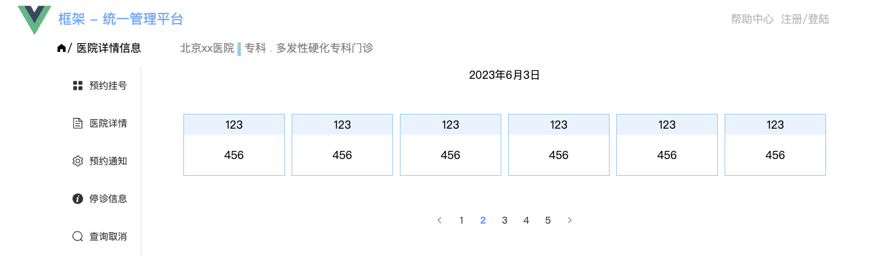
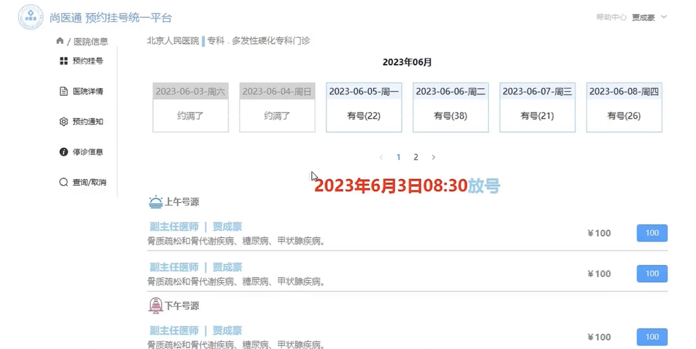
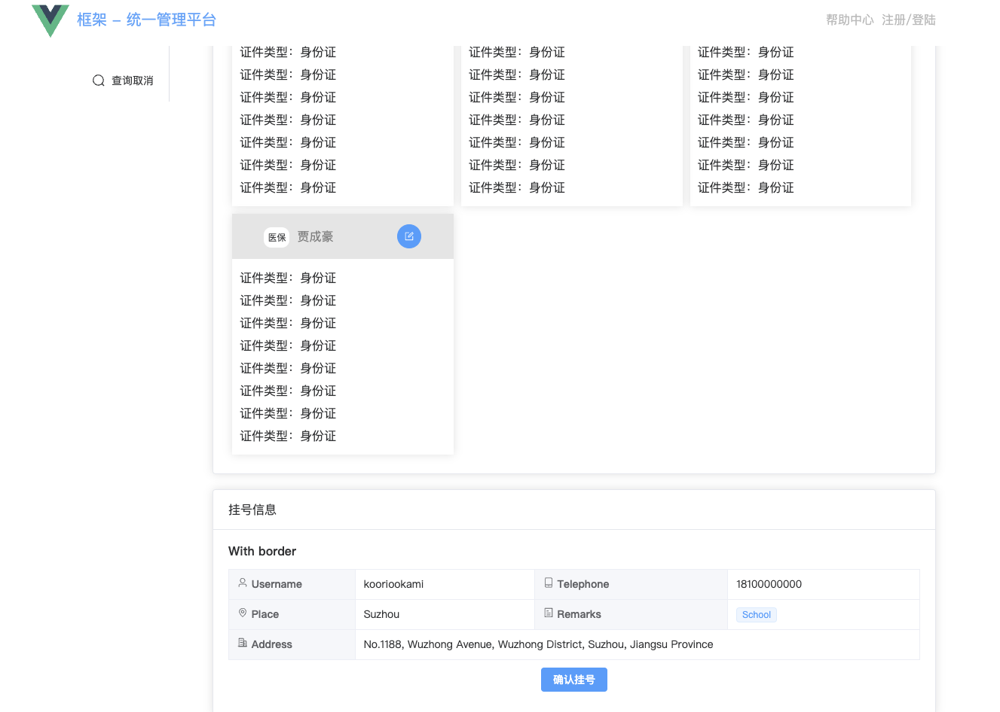
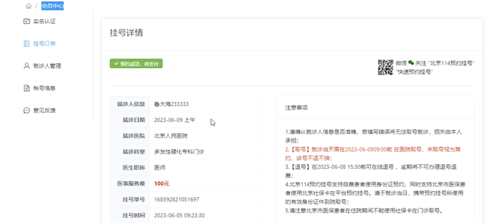

# 第六章 预约挂号、会员中心、订单详情

## 1 预约挂号

点击预约挂号，如果没有在登陆状态，需要弹出登陆界面，让用户进行登陆：

+ 登陆成功，进入预约挂号详情界面
+ 登陆不成功，提示对应的错误信息
+ 上面两点需要使用路由鉴权来完成**（最后来做路由鉴权）**

**首先新建一个预约挂号的详情界面，并补充路由：**

framework/src/pages/hospital/register/register_step1.vue

```vue
<template>
    <div class="wrap">
        <div class="top">
            <div class="hosname">北京xx医院</div>
            <div class="line"></div>
            <div>专科</div>
            <div class="dot">.</div>
            <div class="hosdepartment">多发性硬化专科门诊</div>
        </div>

        <div class="center">
            <h1>2023年6月3日</h1>
            <div class="container">
                <div class="item" v-for="item in 6" :key="item">
                    <div class="top1">123</div>
                    <div class="bottom">456</div>
                </div>
                <el-pagination layout="prev, pager, next" :total="50"></el-pagination>
            </div>
        </div>

    </div>
</template>

<script setup lang="ts">

</script>

<style scoped lang="scss">
.wrap{
    .top{
        display: flex;
        color: #7f7f7f;
        .line{
            width: 5px;
            height: 20px;
            background: skyblue;
            margin: 0px 5px;
        }

        .dot{
            margin: 0px 5px;
            color: skyblue;
        }
    }

    .center{
        margin: 20px 0px;
        display: flex;
        flex-direction: column;
        align-items: center;
        .time{
            font-weight: 900;
        }

        .container{
            width: 100%;
            display: flex;
            margin: 50px 0px;
            .item{
                flex: 1;
                border: 1px solid skyblue;
                margin: 0px 5px;
                flex-direction: column;
                align-items: center;
                .top1{
                    background: #e8f2ff;
                    height: 30px;
                    width: 100%;
                    text-align: center;
                    line-height: 30px;
                }

                .bottom{
                    width: 100%;
                    height: 60px;
                    text-align: center;
                    line-height: 60px;
                }
            }
        }
    }
}
</style>
```

framework/src/router/index.ts

```typescript
{
  	path: 'register_step1',
    component: () => import('../pages/hospital/register/register_step1.vue')
}
```



**剩余的前端界面都是类似的，搭建过程省略。效果图如下，相信到这里已经可以自行搭建：**




## 2 预约挂号就诊人 - 静态

点击预约挂号 -> 会跳转到确认信息界面 -> 新建、点击就诊人 -> 选中就诊人 -> 确认挂号

**本节主要针对上述流程进行静态页面的搭建。**

首先新建一个预约挂号的第二部分静态界面 framework/src/pages/hospital/register/register_step2.vue

```vue
<template>
    <div class="container">
        <h1 class="tip">确认挂号信息</h1>
        <!-- 卡片：展示就诊人信息 -->
        <el-card class="box-card">
            <template #header>
                <div class="card-header">
                    <span>请选择就诊人</span>
                    <el-button type="primary" size="default" :icon="User">添加就诊人</el-button>
                </div>
            </template>
            <!-- 就诊人卡片组件 -->
            <div class="user">
                <visitor v-for="item in 4" :key="item" class="item"></visitor>
            </div>
        </el-card>

        <!-- 卡片：展示医生信息 -->
        <el-card class="box-card">
            <template #header>
                <div class="card-header">
                    <span>挂号信息</span>
                </div>
            </template>
            <!-- 详细表格信息 -->
            <el-descriptions class="margin-top" title="With border" :column="2" border>
                <el-descriptions-item>
                    <template #label>
                        <div class="cell-item">
                            <el-icon :style="iconStyle">
                                <user />
                            </el-icon>
                            Username
                        </div>
                    </template>
                    kooriookami
                </el-descriptions-item>
                <el-descriptions-item>
                    <template #label>
                        <div class="cell-item">
                            <el-icon :style="iconStyle">
                                <iphone />
                            </el-icon>
                            Telephone
                        </div>
                    </template>
                    18100000000
                </el-descriptions-item>
                <el-descriptions-item>
                    <template #label>
                        <div class="cell-item">
                            <el-icon :style="iconStyle">
                                <location />
                            </el-icon>
                            Place
                        </div>
                    </template>
                    Suzhou
                </el-descriptions-item>
                <el-descriptions-item>
                    <template #label>
                        <div class="cell-item">
                            <el-icon :style="iconStyle">
                                <tickets />
                            </el-icon>
                            Remarks
                        </div>
                    </template>
                    <el-tag size="small">School</el-tag>
                </el-descriptions-item>
                <el-descriptions-item>
                    <template #label>
                        <div class="cell-item">
                            <el-icon :style="iconStyle">
                                <office-building />
                            </el-icon>
                            Address
                        </div>
                    </template>
                    No.1188, Wuzhong Avenue, Wuzhong District, Suzhou, Jiangsu Province
                </el-descriptions-item>
            </el-descriptions>
            <!-- 确认挂号按钮 -->
             <div class="btn">
                <el-button type="primary" size="default">确认挂号</el-button>
             </div>
        </el-card>
    </div>
</template>

<script setup lang="ts">
import visitor from './visitor.vue';
import { computed, ref } from 'vue'
import {
    Iphone,
    Location,
    OfficeBuilding,
    Tickets,
    User,
} from '@element-plus/icons-vue'
</script>

<style scoped lang="scss">
.container {
    .tip {
        font-weight: 900;
        color: #7f7f7f;
        font-size: 20px;
    }

    .box-card {
        margin: 20px 0px;

        .card-header {
            display: flex;
            justify-content: space-between;
            align-items: center;
        }

        .user {
            display: flex;
            flex-wrap: wrap;

            .item {
                width: 32%;
                margin: 5px;
            }
        }
    }

    .btn{
        display: flex;
        justify-content: center;
        margin: 10px 0px;
    }
}
</style>
```

同时配置静态路由：

framework/src/router/index.ts

```typescript
{
 	 path: 'register_step2',
   component: () => import('../pages/hospital/register/register_step2.vue')
}
```

为了展示每一个就诊人，对就诊人信息进行封装：framework/src/pages/hospital/register/visitor.vue

```vue
<template>
    <div class="visitor">
        <div class="top">
            <div class="left">
                <span class="free">医保</span>
                <span class="username">贾成豪</span>
            </div>

            <div class="right">
                <el-button circle type="primary" size="default" :icon="Edit"></el-button>
            </div>
            
        </div>
        <div class="bottom">
            <p>证件类型：身份证</p>
            <p>证件类型：身份证</p>
            <p>证件类型：身份证</p>
            <p>证件类型：身份证</p>
            <p>证件类型：身份证</p>
            <p>证件类型：身份证</p>
            <p>证件类型：身份证</p>
            <p>证件类型：身份证</p>
        </div>
    </div>
</template>

<script setup lang="ts">
import { Edit } from '@element-plus/icons-vue';


</script>

<style scoped lang="scss">
.visitor{
    box-shadow: 0px 0px 12px rgba(0,0,0,0.12);
    .top{
        height: 60px;
        background: #e5e5e5;
        display: flex;
        justify-content: space-around;
        align-items: center;
        .left{
            .free{
                background: white;
                padding: 5px;
                font-size: 12px;
                margin-right: 10px;
                border-radius: 10px;
            }
            .username{
                color: #7f7f7f;
            }
        }
    }

    .bottom{
        padding: 10px;
        p{
            line-height: 30px;
        }
    }
}
</style>
```




## 3 会员中心路由

点击挂号之后，进入新的一级路由组件操作 -> 会员中心路由组件




## 4 订单详情