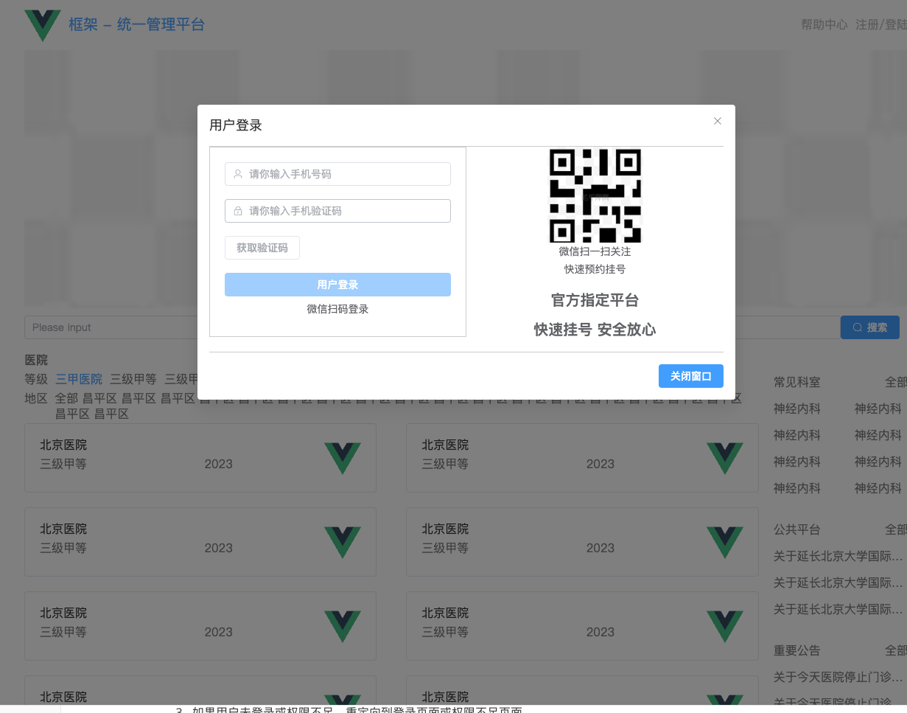

# 第七章 路由鉴权

## 1 介绍

在 Vue 中，**路由鉴权**（Routing Authentication）是指在应用的路由导航过程中，对用户的访问权限进行验证和控制。通常用于确保用户在访问特定页面时，是否有足够的权限或者是否已通过身份验证。

**路由鉴权**的核心目的是保护某些页面或者资源，防止未授权的用户访问。通常情况下，它涉及到以下两个方面：

1. **身份验证（Authentication）**：确认用户身份是否已通过验证（例如，用户是否已经登录）。
2. **授权（Authorization）**：验证已认证的用户是否有权限访问特定资源或页面。

**路由鉴权的实现方式：**

在 Vue 中，路由鉴权通常结合 `vue-router` 和 **导航守卫** 来实现。

使用 `vue-router` 提供的 **导航守卫** 来在路由跳转前检查用户是否符合访问权限。

`beforeEach` 是一个全局守卫，它会在路由导航发生之前被调用。你可以在这里检查用户是否已登录（或具备访问权限）。

```javascript
// router/index.ts
import router from './router';

router.beforeEach((to, from, next) => {
  const isAuthenticated = localStorage.getItem('token'); // 从本地存储获取登录状态或 token
  
  if (to.meta.requiresAuth && !isAuthenticated) {
    // 如果访问的路由需要鉴权且用户未登录，跳转到登录页面
    next({ name: 'Login' });
  } else {
    // 否则继续导航
    next();
  }
});
```

鉴权的核心逻辑通常是：

- **判断用户是否已登录**：通过检查本地存储、cookie、session 或其他方式来确认用户是否登录。
- **判断用户是否有权限**：有些页面可能要求特定角色或权限才能访问，你可以通过 `meta` 字段或者其他方式标记是否需要某种角色或权限。

**具体实现例子：**

- **登录验证**：如果用户没有登录，访问需要鉴权的页面时会被重定向到登录页面。
- **角色权限控制**：如果用户已经登录，但没有相应权限访问某个页面，页面可以跳转到一个权限不足页面，或者展示提示信息。

#### 示例：用户未登录时访问需要鉴权的页面

```java
// 需要鉴权的页面
{
  path: '/dashboard',
  name: 'Dashboard',
  component: () => import('../views/Dashboard.vue'),
  meta: { requiresAuth: true } // 需要鉴权
}

// router/index.ts
import router from './router';

router.beforeEach((to, from, next) => {
  const isAuthenticated = localStorage.getItem('token');  // 假设你用 token 来判断是否登录

  if (to.meta.requiresAuth && !isAuthenticated) {
    next({ name: 'Login' }); // 未登录，重定向到登录页面
  } else {
    next(); // 允许访问
  }
});
```

#### 示例：角色权限控制

假设你有不同的角色，比如管理员和普通用户，只有管理员可以访问 `/admin` 页面。

```java
// 需要鉴权的页面
{
  path: '/dashboard',
  name: 'Dashboard',
  component: () => import('../views/Dashboard.vue'),
  meta: { requiresAuth: true } // 需要鉴权
}

// router/index.ts
import router from './router';

router.beforeEach((to, from, next) => {
  const userRole = localStorage.getItem('role'); // 假设你从本地存储中获取用户角色
  
  if (to.meta.requiresAdmin && userRole !== 'admin') {
    next({ name: 'Unauthorized' }); // 没有权限，跳转到未授权页面
  } else {
    next(); // 允许访问
  }
});
```

**路由鉴权**是在用户访问页面时，利用 **导航守卫**（`beforeEach`）来判断用户是否通过身份验证以及是否具备访问权限。如果不符合要求，可以通过重定向到登录页面或其他页面来限制访问。通常的步骤包括：

1. 配置需要鉴权的路由。
2. 使用 `beforeEach` 导航守卫来检查用户是否已登录。
3. 如果用户未登录或权限不足，重定向到登录页面或权限不足页面。


## 2 路由鉴权实践

路由实践：

+ 如果用户没有登陆，可以访问的只有首页一级路由一级挂号页面，其他页面不可以访问。

+ 如果用户未登陆，想要访问其他路由，则会自动跳转到首页
+ 用户未登陆可以访问：
  + /home
  + /hospital/register
  + /hospital/detail
  + /hospital/notice
  + /hospital/close
  + /hospital/search
+ 用户登陆后才可以访问：
  + 剩余所有界面

**framework/src/permission.ts**

```typescript
// 全局守卫
import router from "./router"
// 引入进度条
import Nprogress from 'nprogress'
//引入进度条的样式
import "nprogress/nprogress.css"
import useUserStore from "./store/modules/user"
import panic from "./store"
let userStore = useUserStore(panic);

Nprogress.configure({showSpinner: false})

router.beforeEach((to, from, next) => {
    Nprogress.start();

    let whiteList = ["/home", '/hospital/register'];  // 白名单
    let token = userStore.userInfo.token;

    if (token) {
        next();  // 如果有token，直接进入
    } else {
        if (whiteList.includes(to.path)) {
            next();  // 如果是白名单中的页面，允许访问
        } else {
            userStore.visiable = true;  // 显示登录框
            next({ path: '/home' });  // 未登录跳转到登录页
        }
    }
})

router.afterEach(() => {
    Nprogress.done();  // 路由跳转完后关闭进度条
})

```

**framework/src/main.ts**

```
// 引入pinia
import pinia from './store'
import'./permission
```

**点击不允许的界面，会自动弹出登陆窗口，并返回首页：**

