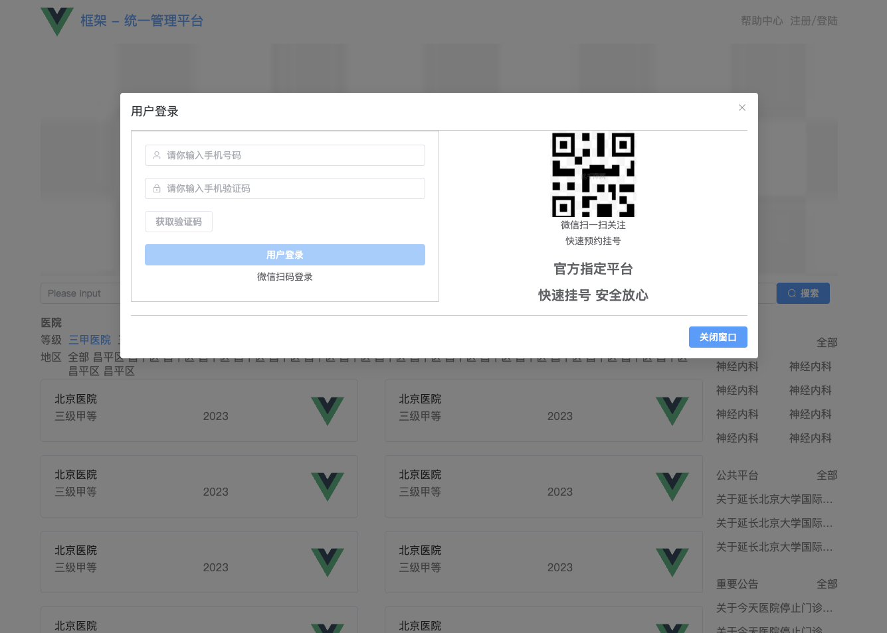
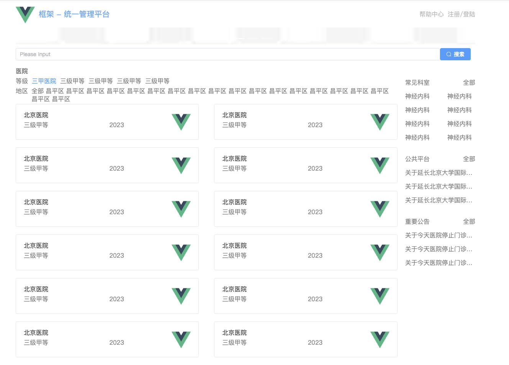
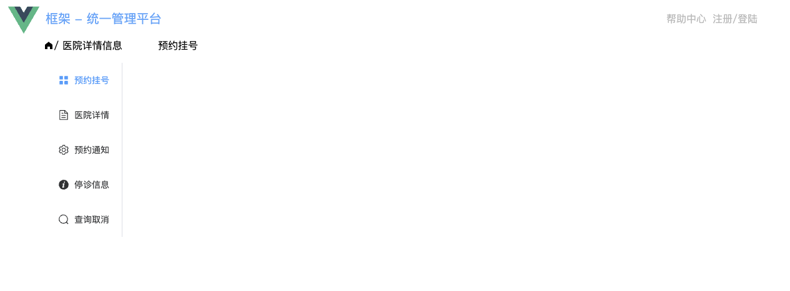

# VUE3 静态搭建学习路径

**学习路径：**

1. [初始化以及框架搭建](https://github.com/Tjyy-1223/Vue-TS-Guide/blob/main/1%20%E5%88%9D%E5%A7%8B%E5%8C%96%E4%BB%A5%E5%8F%8A%E6%A1%86%E6%9E%B6%E6%90%AD%E5%BB%BA.md)
2. [路由搭建以及组件拆分](https://github.com/Tjyy-1223/Vue-TS-Guide/blob/main/2%20%E8%B7%AF%E7%94%B1%E6%90%AD%E5%BB%BA%E4%BB%A5%E5%8F%8A%E7%BB%84%E4%BB%B6%E6%8B%86%E5%88%86.md)
3. [Axios 二次封装与代理跨域](https://github.com/Tjyy-1223/Vue-TS-Guide/blob/main/3%20Axios%20%E4%BA%8C%E6%AC%A1%E5%B0%81%E8%A3%85%E4%B8%8E%E4%BB%A3%E7%90%86%E8%B7%A8%E5%9F%9F.md)
4. [首页右侧搭建、菜单以及子路由](https://github.com/Tjyy-1223/Vue-TS-Guide/blob/main/4%20%E9%A6%96%E9%A1%B5%E5%8F%B3%E4%BE%A7%E6%90%AD%E5%BB%BA%E3%80%81%E8%8F%9C%E5%8D%95%E4%B8%8E%E5%AD%90%E8%B7%AF%E7%94%B1%E3%80%81Pania%20%E5%BA%94%E7%94%A8.md)
5. [登陆模块、退出登录以及微信登录](https://github.com/Tjyy-1223/Vue-TS-Guide/blob/main/5%20%E7%99%BB%E9%99%86%E6%A8%A1%E5%9D%97%E3%80%81%E9%80%80%E5%87%BA%E7%99%BB%E5%BD%95%E4%BB%A5%E5%8F%8A%E5%BE%AE%E4%BF%A1%E7%99%BB%E5%BD%95.md)
6. [预约挂号、会员中心、订单详情](https://github.com/Tjyy-1223/Vue-TS-Guide/blob/main/6%20%E9%A2%84%E7%BA%A6%E6%8C%82%E5%8F%B7%E3%80%81%E4%BC%9A%E5%91%98%E4%B8%AD%E5%BF%83%E3%80%81%E8%AE%A2%E5%8D%95%E8%AF%A6%E6%83%85.md)
7. [路由鉴权]

------

**最终静态页面搭建效果：**

